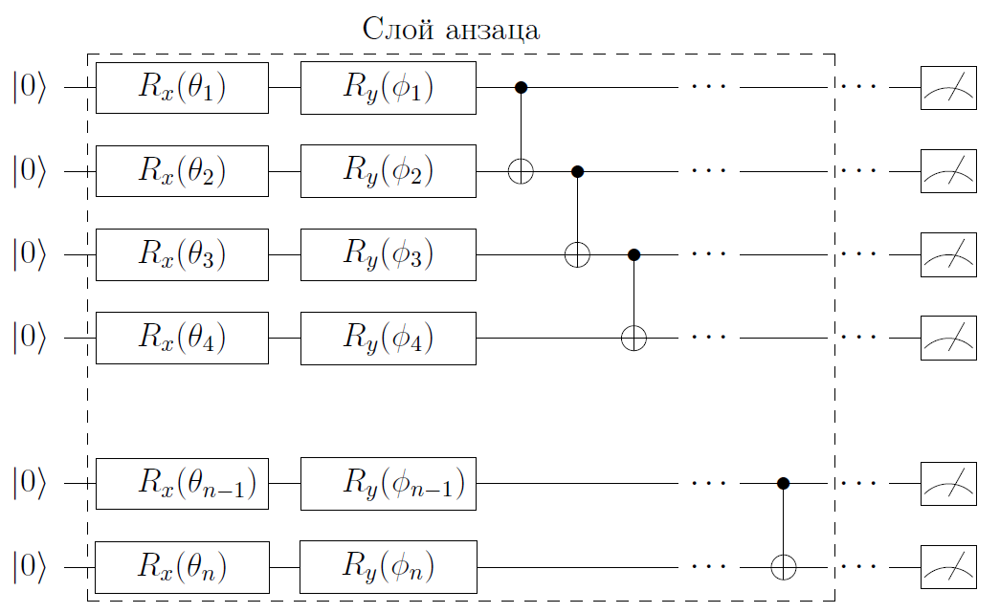
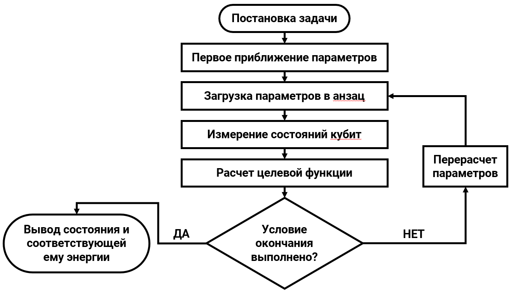
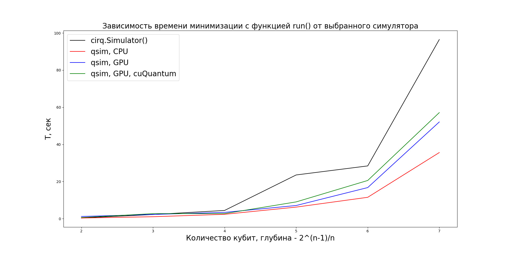
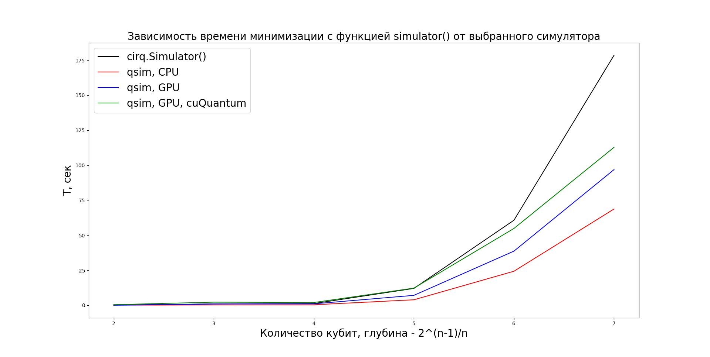
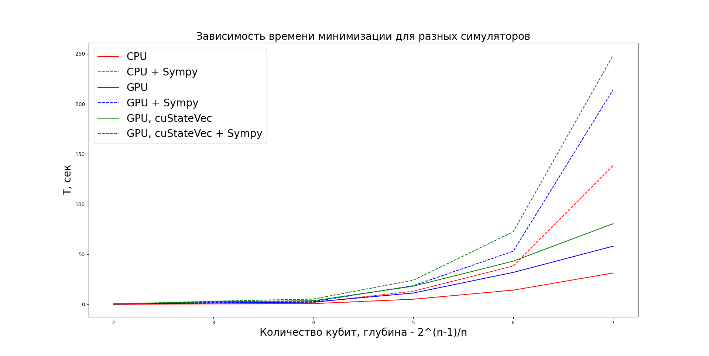
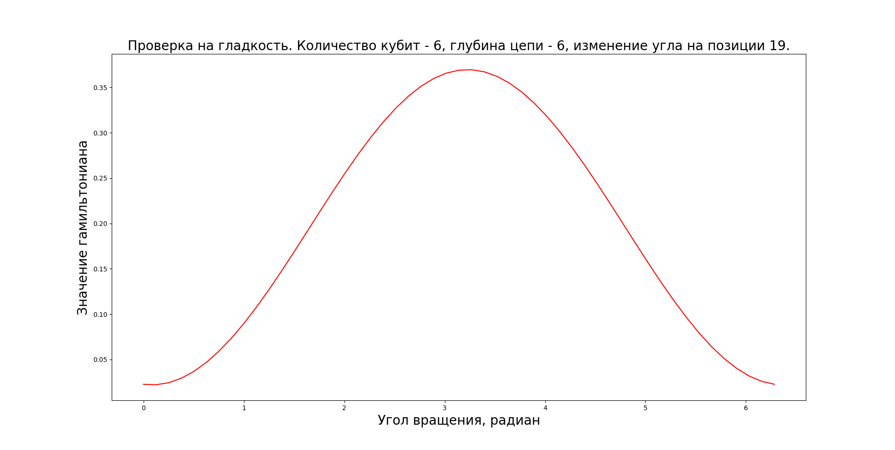
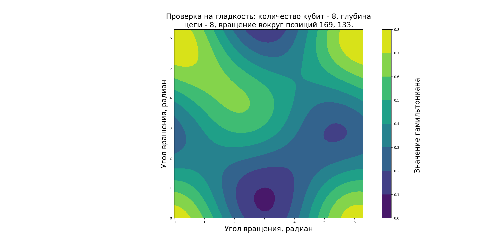
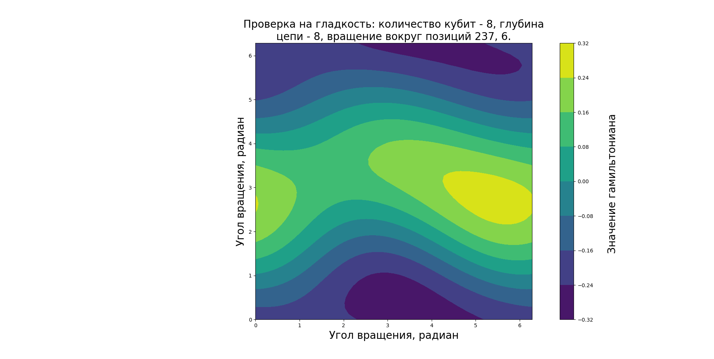
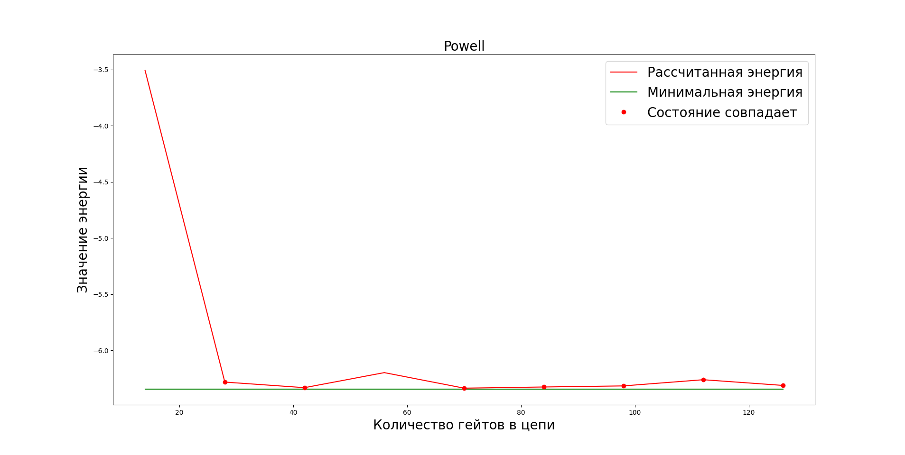
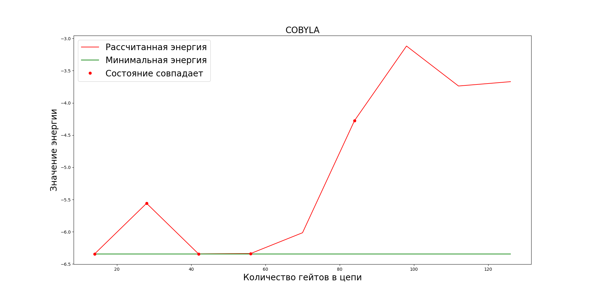

**VQE (Variational Quantum Eigensolver)** - перспективный и достаточно удобный алгоритм для работы с многомерной оптимизацией, который использует принципы квантовой механики для ускорения и улучшения решения оптимизационных задач.

Используемое оборудование:
 - CPU: Intel(R) i5-11400, 2.6 GHz
 - GPU: NVIDIA GeForce RTX 3070 Laptop GPU
 - RAM: 32 Gb
 - Большая часть всех вычислений проводится на базе WSL2 (Ubuntu 22.04.5 LTS)
#### Введение
###### Анзац

Квантовая цепь, генерирующая некоторое состояние с помощью параметризованных вентилей поворота и одного вида запутывающих гейтов называется анзац:

<font color="#646a73"><center>Рис. 1. Вид анзаца</center></font>

Для генерации различных состояний нужно подобрать нужные гейты вращения:


<font color="#646a73"><center>Рис. 2. Однокубитные повороты</center></font>

Видно, что так как наблюдения ведутся в Z-базисе, то вращения на сфере Блоха вокруг него не ведут к каким-то интересующим изменениям, поэтому парой вращающих вентилей выбирают - $R_{x}(\theta)$ и $R_{y}(\phi)$, а запутывающим гейтом обычно выбирается тот, который легче всего реализовать на практике, например, iSWAP.

Важнейшая характеристика анзаца - его глубина. 
Состояние из $n$ кубит представляет из себя $2^{n}$ чисел в гильбертовом пространстве, а поэтому, для получения всех состояний представимых в гильбертовом пространстве размерности $2^{n}$, нужно такое же количество параметризованных гейтов. Тогда имеет место следующая формула:$$D = \frac{2^{n-1}}{n}$$где $D$ - глубина цепи, $n$ - количество кубит.
###### Ground-State системы

В квантовой механике вводится определение средней величины:
$$\langle A \rangle =\bra{\psi}\widehat{A}\ket{\psi}$$
В таком случае можно ввести понятие **Ground-State**. 
**Ground-State** системы - это такое состояние $\ket{\psi}$ при котором среднее значение оператора энергии (гамильтониана) минимально, т.е. : 
$$E \le \bra{\psi}\widehat{H}\ket{\psi}$$
Так как для большинства физических систем справедливо, что они находятся в состоянии с минимальной энергией, то определение этого состояния является наиболее интересующей задачей, связанной с физической системой.
###### Квантовые измерения

В квантовых алгоритмах обычно проводятся вычисления в Z-базисе:


<font color="#646a73"><center>Рис. 3. Сфера Блоха</center></font>

В таком случае $\ket{0}$ и $\ket{1}$ - собственные вектора оператора $\widehat{Z} = \begin{pmatrix}1 & 0 \\0 &-1\end{pmatrix}$. Тогда:$$\begin{flalign}
&\ket{0}=\begin{pmatrix}1\\0\end{pmatrix}, \space \lambda = 1 \\
&\ket{1}=\begin{pmatrix}0\\1\end{pmatrix},\space \lambda = -1 \\
\end{flalign}$$
Тогда оператор $\widehat{Z}$ можно записать в дираковских обозначениях: $\widehat{Z}=\ket{0}\bra{0}-\ket{1}\bra{1}$
Как будет показано далее - в контексте VQE, наиболее интересные измерения - это измерения операторов $\widehat{Z_i}$, $\widehat{Z_i}\otimes\widehat{Z_j}$. Покажем, как происходят подобные измерения:

$\bullet\quad\langle\widehat{Z}\rangle=\bra{\psi}\widehat{Z}\ket{\psi}=(c_0^*\bra{0}+c_1^*\bra{1})\times(\ket{0}\bra{0}-\ket{1}\bra{1})\times(c_0\ket{0}+c_1\ket{1})=\left|c_0\right|^2-\left|c_1\right|^2$

$\bullet\quad \widehat{Z}_1\otimes\widehat{Z}_2=(\ket{0}\bra{0}-\ket{1}\bra{1})_1\otimes(\ket{0}\bra{0}-\ket{1}\bra{1})_2=\ket{00}\bra{00}-\ket{01}\bra{01}-\ket{10}\bra{10}+\ket{11}\bra{11}$

$\begin{aligned}\bullet\quad&\langle\widehat{Z}_1\otimes\widehat{Z}_2\rangle= \bra{\psi}\widehat{Z}_1\otimes\widehat{Z}_2\ket{\psi}=(c_{00}^*\bra{00}+c_{01}^*\bra{01}+c_{10}^*\bra{10}+c_{11}^*\bra{11})\times\\&\times(\ket{00}\bra{00}-\ket{01}\bra{01}-\ket{10}\bra{10}+\ket{11}\bra{11})\times(c_{00}\ket{00}+c_{01}\ket{01}+c_{10}\ket{10}+c_{11}\ket{11})=\\&=\left|c_{00}\right|^2-\left|c_{01}\right|^2- \left|c_{10}\right|^2+\left|c_{11}\right|^2\end{aligned}$

В целом, если нужно проводить измерения какого-то оператора, который представляет из себя несколько операторов $\widehat{Z}$, которые действуют на какое-то количество кубитов, то формула для получения среднего значения нужного нам оператора выводится по аналогии аккуратным тензорным перемножением.
Иногда, оказывается полезным измерение операторов $\widehat{X}$, $\widehat{Y}$. Их измерение в Z-базисе невозможно, поэтому нужно перевести их в Z-базис с помощью следующих преобразований:

$\bullet \quad \widehat{X}=\widehat{H}\widehat{Z}\widehat{H}\quad\Rightarrow\quad\langle\widehat{X}\rangle=\bra{\psi}\widehat{X}\ket{\psi}=\bra{\psi}\widehat{H}\widehat{Z}\widehat{H}\ket{\psi}=\bra{\psi'}\widehat{Z}\ket{\psi'}$, где $\ket{\psi'}=\widehat{H}\ket{\psi}$

$\bullet \quad \widehat{Y}=\widehat{S}\widehat{H}\widehat{Y}\widehat{H}\widehat{S}^\dagger\quad\Rightarrow\quad\langle\widehat{Y}\rangle=\bra{\psi}\widehat{Y}\ket{\psi}=\bra{\psi}\widehat{S}\widehat{H}\widehat{Y}\widehat{H}\widehat{S}^\dagger\ket{\psi}=\bra{\psi''}\widehat{Z}\ket{\psi''}$, где $\ket{\psi''}=\widehat{H}\widehat{S}^\dagger\ket{\psi}$

В целом же, некоторое тензорное произведение операторов Паули, действующих на разные кубиты, называется *строкой Паули*.
###### Модель Изинга

Модель Изинга - математическая модель, описывающая механизм намагниченности, которая выглядит следующим образом:
$$H = -J\sum_{i=1}^{n-1}\sigma_z^i\sigma_z^{i+1}-h_z\sum_{i=1}^n\sigma_z^i$$
Здесь первая сумма представляет из себя взаимодействие между соседними атомами, а вторая - действие поперечного магнитного поля на атомы. $\sigma_z^i$ в данном случае принимает значение -1 (поле вниз) или 1 (поле вверх). Решением данной модели является список из значений $\sigma_z^1$, $\sigma_z^2$, ... ,$\sigma_z^n$, такой чтобы $H$ принимало минимальное значение, которое соответствует реальному распределению спинов в цепочке атомов при действии на них заданного магнитного поля.

Данной модели Изинга соответствует гамильтониан:$$\widehat{H} = -J\sum_{i=1}^{n-1}\widehat{\sigma}_z^i\widehat{\sigma}_z^{i+1}-h_z\sum_{i=1}^n\widehat{\sigma}^i_z$$Такой гамильтониан можно записать в матричном виде, в котором он будет выглядеть как диагональная матрица ($\widehat{\sigma}_z$ представляется в виде диагональной матрицы, а действие на атом номером k в таком случае представляется в виде $\widehat{I}_1\otimes{}\widehat{I}_2\otimes{}\ldots\otimes{}\widehat{I}_{k-1}\otimes{}\widehat{\sigma}_z\otimes{}\widehat{I}_{k+1}\otimes{}\ldots\otimes{}\widehat{I}_n$, где $\widehat{I}_i$ - единичный оператор на позиции $i$, следовательно тензорное произведение будет выражаться диагональной матрицей, а сумма таких тензорных произведений - тоже будет выражаться диагональной матрицей).

В таком случае спектр гамильтониана - все числа на диагонали, а минимальное из этих чисел - минимальная энергия данной системы. Тогда Ground-State данной системы в векторном виде - вектор длиной $2^n$, состоящий из $2^n-1$ нулей и $1$ единицы.

Такой вектор представим в виде тензорного произведения из $n$ штук $\ket{0}$ и $\ket{1}$, соответственно получается, что таким образом была получена волновая функция для $n$ атомов, которая и является Ground-State данной системы.

Таким образом получается соответствие между моделью Изинга в операторном виде и классической моделью Изинга. Решение каждой - список из состояний атомов, в первом случае состоящий из элементов $\ket{0}$ и $\ket{1}$, а во втором - из -1 и 1.

В модель Изинга также можно ввести продольное магнитное поле, его действие на атомы задается следующей суммой (в операторном виде): $h_x\sum_{i=1}^n\widehat{\sigma}_x^i$

В данном случае однако, решение классической модели Изинга не будет выражаться таким простым образом. Так как $\widehat{\sigma}_x$ представима в виде недиагональной матрицы, то и сам гамильтониан будет представим в виде недиагональной матрицы, а следовательно - ее Ground-State это суперпозиция из нескольких состояний. 

-1 и 1 в классической модели, вообще говоря, выражают собой среднее значение $\widehat{\sigma}_z$ в двух крайних состояниях - состоянии вверх и вниз, что соответствует $\ket{\psi} =\ket{0}$ и $\ket{\psi} =\ket{1}$. В случае если $\ket{\psi}$ - некоторое запутанное состояние, то согласно формулам из раздела выше, среднее значение $\langle\widehat{\sigma}_z\rangle\in[-1,1]$. 

Итак, если внешнее магнитное поле - чисто поперечное, то решение классической модели Изинга полностью бинаризованное, но если есть некоторая поперечная составляющая, то решение будет списком из действительных чисел, иначе говоря чисто поперечное поле дает  дискретное решение, а поле с продольной составляющей - непрерывное. 

В целом, можно еще более обобщить модель Изинга:
$$H = -\sum_{i\ne{j}}J_{ij}\sigma_z^i\sigma_z^{j}-\sum_ih_z^i\sigma_z^i-\sum_ih_x^i\sigma_x^i$$
Такая модель учитывает и поперечное, и продольное магнитные поля, при этом значение их действия на каждый атом может быть различным. То же самое актуально и для пар атомов, которые могут взаимодействовать с уникальными коэффициентами для каждой пары.

Чем же интересна модель Изинга?

Модель Изинга - это прежде всего модель о поведении квантовых частиц в некоторых условиях (атомы в магнитном поле). Классическая модель Изинга применяется в расчетах некоторых числовых материалов для описания их поведения в магнитном поле. При этом размерность задачи растет очень быстро (системе из $n$ частиц в поперечном магнитном поле соответствует $2^n$ состояний системы), поэтому для решения данной модели применяются приближенные методы решения, например, метод Метрополиса. Иначе говоря, модель Изинга позволяет определить макрохарактеристики микросистемы (в терминологии статистической физики).

Однако приближенные методы не дают точного решения, а также макрохарактеристики не могут описать некоторые феномены, для которых нужно уже микроописание системы.

В таком случае реализуют другой подход - систему стараются описать с помощью другой контролируемой системы. В данном случае из-за масштаба рассматриваемых явлений сама система - квантовая (цепочка атомов), а соответственно и подход к ее описанию должен быть квантовый. Таким образом, получается, что классическая модель Изинга и проблемы описания микрохарактеристик с ней связанных, фактически, подводят к использованию квантовых компьютеров и квантовых алгоритмов. 

Однако, если модель Изинга была бы нужна для лишь одной достаточно узкой задачи, которую можно каким-то образом посчитать на квантовом компьютере, то разговоров о ней было бы куда меньше. Оказывается, достаточно широкий класс задач из области многомерной оптимизации можно свести к модели Изинга, то есть с помощью данной модели можно решать изначально не квантовые задачи квантовым подходом.
###### QUBO-задачи

QUBO (Квадратичная неограниченная двоичная оптимизация) - это такой класс задач, в которых целевая функция задана следующим выражением:
$$f_q(x) = x^TQx = \sum_{i=1}^n\sum_{j=1}^nQ_{ij}x_ix_j, \quad x_i\in[0, 1]$$
Решением такой задачи является вектор $\overrightarrow{x}=[x_1, x_2, \ldots, x_n]$, который обычно либо минимизируется, либо максимизируется.

Данная сумма, вообще говоря, распадается на две суммы, одна из которых содержит только перекрестные члены $x_ix_j$, а вторая - квадраты переменных $x_i^2$, но так как $x_i\in[0, 1]$, то $x_i^2=x_i$, то, соответственно, целевую функцию можно записать следующим образом:
$$f_q(x) = \sum_{i\ne{j}}Q_{ij}x_ix_j + \sum_{i}Q_{ii}x_i$$
Получается, что целевая функция содержит в себе как квадратичный член, так и линейный.

QUBO-задачи - это очень общий вид задач, поэтому к ним могут быть сведены многие задачи классического машинного обучения (регрессии, метод опорных векторов, кластеризация), однако более интересно найти практическое приложение задач QUBO. Для этого стоит обозначить следующий момент - ограничения по задаче в исходной форме вводятся только лишь весами перед соответствующими переменными. На практике же, на полученное решение часто накладываются внешние линейные ограничения вида равенств или неравенств, поэтому необходимо отметить как задать их в QUBO-модели:

- Ограничения вида  $\sum_{i=1}^na_ix_i = b$
	Первым делом, нужно проверить, имеет ли заданное ограничение решение любым из доступных методов, например: $\parallel{\sum_{i=1}^na_ix_i - b}\parallel^2 \longrightarrow min$. В данном случае, если минимизация дает любой, отличный от нуля ответ, то задачу с таким ограничением невозможно решить.
	Если решение существует, тогда к исходной целевой функции нужно добавить следующий член: $$(\sum_{i=1}^na_ix_i - b)^2$$

- Ограничение вида $\sum_{i=1}^na_ix_i \le b$
	Данное ограничение вводится следующим образом: вводится некоторая целочисленная переменная $Z$, тогда ограничение вводится в модель добавлением следующего члена: $$P(\sum_{i=1}^na_ix_i+Z - b)^2$$
	Здесь P - некоторый штрафной коэффициент, который выбирается для задачи.

- Ограничение вида $\sum_{i=1}^na_ix_i \ge b$
	Сводится к ограничению выше, домножением коэффициентов $a_i$ на $-1$.

Также стоит отметить, что QUBO работает не только с бинарными переменными, но для этого их надо бинаризировать:

- Целые переменные: $x_i=l_i+f(u_i -l_i)$, где $f(b)=\sum_1^{[\log_2{b+1]}}2^{i-1}y_i$, где $x_i\in[l_i,u_i]$, $y_i\in[0,1]$
- Дискретные переменные: $x_i=\sum_1^ma_iy_i$, где $x_i\in[a_1, a_2, \ldots, a_m]$, $y_i\in[0,1]$.
- Непрерывный случай: выбираем точность и переходим к дискретному случаю.

Последнее, что стоит отметить - взаимосвязь модели Изинга и QUBO-модели. Данные модели очень похожи друг на друга, но в них отличаются сами переменные с которыми они работают, которые связаны следующим соотношением:
$$x_i=\frac{1+\sigma_i}{2}, \quad x_i\in[0,1], \quad \sigma_i \in[-1,1]$$
Таким образом все то множество задач, которое может быть решено QUBO-подходом, может быть переведено в модель Изинга, а соответственно может быть решено на квантовом оборудовании.
###### QUBO-формулировка и модель Изинга на примере задачи рюкзака

Классическая формулировка задачи: имеется $n$ предметов. Для них имеется:
- $\overrightarrow{w}=[w_1, w_2, \ldots, w_n]$ - список с весом каждого груза
- $\overrightarrow{v}=[v_1, v_2, \ldots, v_n]$ - список с количественной ценностью каждого груза
- $W_{max}$ - максимально допустимый вес
Нужно собрать рюкзак так, чтобы он имел максимальную ценность.

Для QUBO формулировки воспользуемся правилами, обозначенными выше.
У нас есть линейное ограничение вида $\sum_{i=1}^nw_ix_i\le W_{max}$, соответственно, целевая функция выглядит следующим образом:$$QUBO = P\left(W_{max} - \sum_1^nw_ix_i-Z\right)^2-\sum_1^nv_ix_i$$
$P$ выбирается таким образом, штраф был точно больше второй суммы. Для этой задачи можно выбрать $P=max(w_i)+1$. 

$Z$ же является целой переменной и в соответствии с правилами выше: $0\le m \le W_{max}$. В таком случае $Z=\sum_1^{[\log_2{b+1]}}2^{i-1}y_i$, а значит модель будет выглядеть следующим образом: $$QUBO = P\left(W_{max} - \sum_1^nw_ix_i-\sum_1^{[\log_2{b+1]}}2^{i-1}y_i\right)^2-\sum_1^nv_ix_i$$Раскрывая скобки и избавляясь от констант, получим:
$$\begin{aligned}
&QUBO = 2P\left(\sum_{i\ne{j}}w_iw_jx_ix_j+\sum_{i\ne{j}}2^{i+j-2}y_iy_j+\sum_{i,j}2^{j-1}w_ix_iy_j\right) -\sum_iv_ix_i -\\
&-2PW_{max}\left(\sum_iw_ix_i+\sum_i2^{i-1}y_i\right) +P\left(\sum_iw_i^2x_i+\sum_i2^{2i-2}y_i\right)

\end{aligned}$$
Модель Изинга же получается подстановкой $x_i=\frac{1+\sigma_i}{2}$ в QUBO модель:$$H = P\left(W_{max} - \sum_1^nw_i \frac{1+\sigma_i}{2}-\sum_1^{[\log_2{b+1]}}2^{i-1} \frac{1+t_i}{2}\right)^2-\sum_1^nv_i \frac{1+\sigma_i}{2}$$
После раскрытия скобок и избавления от констант, получим:
$$\begin{aligned}
&H = \frac{P}{2}\left(\sum_{i\ne{j}}w_iw_j\sigma_i\sigma_j+\sum_{i\ne{j}}2^{i+j-2}t_it_j+\sum_{i,j}2^{j-1}w_i\sigma_it_j\right) -\frac{1}{2}\sum_iv_i\sigma_i -\\
&-PL\left(\sum_iw_i\sigma_i+\sum_i2^{i-1}t_i\right), 
\quad L=W_{max} - \frac{1}{2}\left(\sum_iw_i+\sum_i2^{i-1}\right)

\end{aligned}$$
Таким образом, были получены QUBO-формулировка и формулировка в виде модели Изинга для задачи рюкзака в явном и в неявном виде.
###### VQE

Алгоритм VQE, как было сказано во введении, предназначен для многомерной оптимизации. Не смотря на то, что он считается квантовым алгоритмом - по сути как-то связанным с квантовыми алгоритмами оказывается лишь один шаг. 

Блок схема алгоритма приведена ниже:

<font color="#646a73"><center>Рис. 4. Блок-схема VQE</center></font>
Перерасчет параметров ведется с помощью классических оптимизаторов, и выбор нужного является достаточно важной задачей, так как оптимизатор должен сочетать в себе как высокую точность попадания в минимум (желательно глобальный, но вообще говоря VQE не гарантирует попадание в глобальный минимум), так и хорошую работу с большим количеством параметров, с которыми так или иначе придется работать, а также, если речь идет о вычислениях на настоящем квантовом компьютере, оптимизация должна быть устойчива к шумам.

Все вышеперечисленное в сухом остатке дает понять, что выбор хорошего оптимизатора - одна из ключевых задач в реализации VQE для какой-то конкретной задачи.
#### Практическая реализация алгоритма VQE

В качестве платформы для реализации VQE было выбрано решение от Google - Cirq. Выбор обусловлен тем, что Cirq обладает удобным синтаксисом, а также тесной интеграцией с некоторыми другими библиотеками, как, например, Tensorflow и ее подмодулем Tensorflow Quantum, которые, будучи одними из самых передовых решений в сфере машинного обучения, в дальнейшем могут использоваться для решения более сложных задач квантового машинного обучения.

Перед реализацией достаточно сложного VQE были реализованы другие, более простые алгоритмы, для того, чтобы наработать навык работы с Cirq. Были реализованы следующие алгоритмы:

- Алгоритм квантовой телепортации
- Алгоритмы, связанные с классическими вычислениями - модуль классической арифметики, а также модули, показывающие возможность практической реализации логических операций (конъюнкция, дизъюнкция, импликация) 
- Алгоритм Дойча
- Алгоритм квантовой отдачи (Phase-Kick)
- Квантовое преобразование Фурье
- Алгоритм квантовой оценки фазы

После реализации данных алгоритмов, в целом, были наработаны базовые навыки работы с Cirq, а также произошло знакомство с общепринятыми практиками работы с данной библиотекой, поэтому дальше была возможность реализовывать более сложные алгоритмы.

Перед рассказом о работе непосредственно с VQE, стоит отметить следующее - моделирование некоторого квантового алгоритма на Cirq происходит следующим образом:

- Инициализация кубитов
- Подготовка цепи
- Симуляция

Последний пункт - симуляция, представляет особый интерес. В Cirq реализованы два подхода к симуляции - **run()** и **simulate()**. Первый дает как результат значения кубит при измерении, по сути моделируя реальные квантовые вычисления, со сбором нужной статистики, второй же на выходе дает финальное состояние системы в виде вектора, или строки в дираковских обозначениях, или в виде матрицы плотности.

Оба подхода применимы в разных случаях. В случае, если необходимо узнать, какое состояние получается на выходе системы более удобно использовать **run()**, так как в худшем случае для данной цепи нужно будет собрать некоторую статистику и найти наиболее вероятное состояние, в то время как определение вектора состояния системы не дает такой удобной возможности по причине того, что он либо представляет из себя вектор длины $2^n$, который необходимо вернуть в вид суперпозиции нескольких состояний, либо, в дираковских обозначениях, объект класса **String()**, который нужно также транслировать в численный вид, чтобы найти наиболее вероятное состояние.

В целом, подход через вектор состояния, конечно, дает более полную информацию о системе с информацией о всех ее возможных состояниях, но задача VQE - дать наиболее вероятное состояние данной системы, которое чаще всего одно, поэтому знание о всех возможных состояниях чаще всего избыточно.

Однако основная ниша **simulate()** в контексте VQE, заключается в другом, а именно, в использовании ее для непосредственной минимизации гамильтониана, так как статистический подход по определению будет давать зашумленный результат, который будет сложнее минимизировать.
###### Базовая реализация VQE

Базовая реализация VQE состоит из следующих модулей:

- Модуль создания/загрузки модели Изинга - векторов $J_x$, $J_z$, отвечающих за действие продольного и поперечного магнитного поля и матрицы $U_{zz}$, отвечающей за силу взаимодействия между кубитами.
- Модуль создания анзаца нужной глубины, зависящего от $2\times n \times d$ параметров, отвечающих за углы поворота в гейтах $R_x$ и $R_z$, где d - глубина анзаца.
- Модуль расчета гамильтониана на основе состояния, генерируемого анзацем
- Модуль минимизации гамильтониана
- Модуль вывода итогового состояния

```python title="Пример реализации для модели с поперечным полем"
import cirq  
import cirq.linalg  
import numpy as np  
from scipy.optimize import minimize  
from functools import partial  
import time  
  
  
def Anzatz(n, teta, depth, measurment_gates=False):  # создание анзаца
    qubits = cirq.LineQubit.range(n)  
    for i in range(depth):  
        yield [cirq.Rx(rads=teta[2 * i * n + j])(qubits[j]) for j in range(n)]  
        yield [cirq.Ry(rads=teta[(2 * i + 1) * n + j])(qubits[j]) for j in range(n)]  
        yield [cirq.CNOT(qubits[j], qubits[j + 1]) for j in range(n - 1)]  
    if measurment_gates:  
        yield [cirq.M(i) for i in qubits]  
  

# среднее значение гамильтониана рассчитанное с помощью run()
def find_mean_hamiltonian_run(n, teta, Uzz, Jz, depth, repetitions):  
    circuit = cirq.Circuit()  
    circuit.append(Anzatz(n, teta, depth, measurment_gates=True))  
    res = cirq.Simulator().run(circuit, repetitions=repetitions).data.to_numpy()  
  
    p = np.array([[(res[:, i] == 0).sum(), (res[:, i] == 1).sum()] for i in range(n)]) / repetitions  
    hamiltonian = np.sum(Jz * (p[:, 0] - p[:, 1]))  
    for i in range(n):  
        for j in range(i + 1, n):  
            hamiltonian += Uzz[i, j] * (p[i, 0] * p[j, 0] - p[i, 0] * p[j, 1] -  
                                        p[i, 1] * p[j, 0] + p[i, 1] * p[j, 1])  
    return hamiltonian  
  

# среднее значение гамильтониана рассчитанное с помощью simulate()
def find_mean_hamiltonian_simulate(n, teta, hamiltonian, depth):  
    circuit = cirq.Circuit()  
    circuit.append(Anzatz(n, teta, depth))  
    res = cirq.Simulator().simulate(circuit).state_vector().reshape((-1, 1))  
    return (np.conj(res.T) @ hamiltonian @ res).real[0, 0]  


# получение состояния с данными параметрами  
def find_state(n, teta, depth):  
    circuit = cirq.Circuit()  
    circuit.append(Anzatz(n, teta, depth, measurment_gates=True))  
    res = cirq.Simulator().run(circuit).data.to_numpy()[0]  
    return res  
  

# точное решение
def exact_solution(Uzz, Jz):  
    n = Jz.shape[0]  
  
    def kron(l):  
        if len(l) > 1:  
            res = l[:-2] + [np.kron(l[-2], l[-1])]  
            return kron(res)  
        elif len(l) == 1:  
            return l[0]  
  
    def mask(n, x):  
        res = np.zeros(n)  
        res[x] = 1  
        return res  
  
    def mask2matrix(mask, matrix):  
        return [matrix if i == 1 else np.eye(2) for i in mask]  
  
    def sumL(l):  
        res = []  
        for i in range(len(l)):  
            res += l[i]  
        return res  
  
    m2mZ = partial(mask2matrix, matrix=np.array([[1, 0], [0, -1]]))  
  
    def fz(x):  
        return kron(m2mZ(mask(n, x)))  
  
    hamiltonianZZ = [[Uzz[i, j] * fz([i, j]) for j in range(i + 1, n)] for i in range(n)]  
    hamiltonianZZ = np.sum(np.array(sumL(hamiltonianZZ)), axis=0)  
    hamiltonianZ = np.sum(np.array([Jz[i] * fz(i) for i in range(n)]), axis=0)  
    hamiltonian = hamiltonianZZ + hamiltonianZ  
  
    binary = bin(int(np.where(hamiltonian == np.min(hamiltonian))[0][0]))[2:]  
    binary = (n - len(binary)) * "0" + binary  
    state = np.array(list(map(int, list(binary))))  
    return np.min(np.linalg.eigvalsh(hamiltonian)), state, hamiltonian  
  
  
n = 3  
depth = 2  
  
Uzz = np.random.random((n, n))  
Jz = np.random.random(n)  
  
ex_energy, ex_state, hamiltonian = exact_solution(Uzz, Jz)  
print(f"Точная минимальная энергия: {ex_energy}")  
print(f"Точное состояние с минимальной энергией: {ex_state}", end="\n\n")  
  
teta1 = np.zeros(2 * n * depth)  
teta2 = np.zeros(2 * n * depth)  
energy_run = partial(find_mean_hamiltonian_run, n, Uzz=Uzz, Jz=Jz, depth=depth, repetitions=1000)
energy_sim = partial(find_mean_hamiltonian_simulate, n, hamiltonian=hamiltonian, depth=depth)  
  
time1 = time.time()  
teta1 = minimize(energy_run, teta1, method="Powell", tol=1e-3).x  
time1 = np.round(time.time() - time1, 2)  
  
time2 = time.time()  
teta2 = minimize(energy_sim, teta2, method="Powell", tol=1e-3).x  
time2 = np.round(time.time() - time2, 2)  
  
print(f"Рассчитанная энергия c помощью run(): {energy_run(teta1)}")  
print(f"Рассчитанная энергия c помощью run(): {energy_run(teta1)}")  
print(f"Рассчитанное состояние с помощью run(): {find_state(n, teta1, depth)}")  
print(f"Время оптимизации - {time1} сек", end="\n\n")  
  
print(f"Рассчитанная энергия c помощью simulate(): {energy_sim(teta2)}")  
print(f"Рассчитанная энергия c помощью simulate(): {energy_sim(teta2)}")  
print(f"Рассчитанное состояние с помощью simulate(): {find_state(n, teta2, depth)}")  
print(f"Время оптимизации - {time2} сек")
```

Примеры вывода данной программы:


<font color="#646a73"><center>Рис. 5. Пример успешной работы VQE</center></font>

<font color="#646a73"><center>Рис. 6. Пример успешной работы VQE</center></font>

<font color="#646a73"><center>Рис. 7. Пример безуспешной работы VQE</center></font>
###### Оптимизация программы

В целом алгоритм VQE работает, но работает не очень оптимизированно, особенно учитывая, что глубина анзаца может быть достаточно глубокой, поэтому стоит попробовать ввести некоторые оптимизации. 

Симуляция квантовой цепи реализована в Cirq таким образом, что она достаточно медленна, так как квантовая цепь симулируется на ядре процессора, однако данную ситуацию можно исправить. 

**qSim** - решение для квантовых вычислений на базе Сirq, реализующее вычисления более эффективно, с возможностью использования GPU. Оно не замещает собой оригинальную библиотеку, но дает возможность создать экземпляр класса **QSimSimulator()**, который замещает собой обычный **Simulator()** и позволяет настроить больше опций для оптимизации вычисления. Данная библиотека интегрируема с **NVIDIA cuQuantum**, которая еще быстрее ускоряет вычисления на видеокартах NVIDIA.

Данная библиотека легко имплементируется в код, поэтому без лишних слов, можно добавить в код выше нужный симулятор, и посмотреть как программа ускорится.


<font color="#646a73"><center>Рис. 8. График зависимости времени минимизации от количества кубит</center></font>

<font color="#646a73"><center>Рис. 9. График зависимости времени минимизации от количества кубит</center></font>
В целом, видно, что qsim позволяет проводить симуляции быстрее, однако видно, что использование GPU не дает превосходства в данном примере, который бы сильно превышал использование только CPU средствами qsim.

Это происходит по двум причинам - во-первых, квантовые цепи не слишком длинные, поэтому сравнительно, время симуляции на видеокарте мало отлично от времени симуляции на процессоре, и здесь большую роль играет время обмена данными между процессором и видеокартой. Во-вторых, время простоя видеокарты очень долгое, так как процессор каждую итерацию пересоздает цепь полностью.

В качестве борьбы с обозначенной выше проблемой можно использовать функционал, поставляемый библиотекой **sympy**. **sympy** позволяет с помощью функции **Symbols()** создать переменную в Python-функции в буквальном смысле. Ускорение заключается в том, что теперь каждый раз анзац не пересоздается, а в него просто подзагружается переменная.

В качестве эксперимента в исходном коде из начала данного раздела необходимо изменить функцию анзаца таким образом, чтобы параметры загружались в соответствующий им символ.  Сделав это, можно посмотреть, ускорилась ли программа.


<font color="#646a73"><center>Рис. 10. График зависимости времени минимизации от количества кубит</center></font>
К сожалению, Sympy - достаточно медленная библиотека, поэтому, даже не смотря на то, что не приходится пересоздавать анзац - программа замедляется. В дальнейшем этот факт можно будет еще раз перепроверить при использовании GPU, так как в случае с GPU, возможно, скорость будет выше из-за меньшего времени простаивания видеокарты.

Имеет смысл рассмотреть влияние на скорость работы несколько иного способа симуляции - simulate_expectation_values(), он принимает на вход наблюдаемую, которую и измеряет, что позволяет не рассчитывать оператор гамильтониана, как в случае c simulate(), но также данный способ - точный, в отличии от run().


<font color="#646a73"><center>Рис. 11. График зависимости времени минимизации от количества кубит</center></font>
В целом, simulate_expectation_values() дает результат со скоростью, меньшей чем simulate() и большей, чем run(), поэтому не использовать данный вид симулятора не имеет смысла, так как он сочетает в себе и гладкость, и относительную скорость, связанную с тем, что наблюдаемая генерируется один раз заранее.

Оставшийся вопрос в оптимизации VQE - общие сравнительные замеры. Будут сравнены следующие комбинации (везде используется simulate_expectation_values(), нигде не используется чистый cirq, так как он точно медленнее):

- qsim, CPU, без настроек, не используется Sympy
- qsim, CPU, без настроек, используется Sympy
- qsim, GPU, без настроек, не используется Sympy
- qsim, GPU, без настроек, используется Sympy
- qsim, GPU + cuQuantum, без настроек, не используется Sympy
- qsim, GPU + cuQuantum, без настроек, используется Sympy


<font color="#646a73"><center>Рис. 12. График зависимости времени минимизации от количества кубит</center></font>
Лучший результат показал qsim для симуляции на CPU без использования Sympy. Этот результат нельзя считать слишком уж удивительным, так как все еще задача имеет не очень большую размерность, а в коде - достаточно много именно процессорной работы, поэтому затраты на обмен данных между видеокартой и процессором сильно выражены.
###### Эксперимент с VQE и его гладкостью

Учитывая полученные знания из блока выше, был получен следующий класс который удобен для импорта в другие файлы:

``` python title="VQE, класс реализующий квантовую цепь и наблюдаемую, с ней связанную, только поперечное поле"
import cirq
import qsimcirq

qsim_simulator = qsimcirq.QSimSimulator()


class Solution:
    def __init__(self, Uzz, Jz, depth):
        self.Uzz = Uzz
        self.Jz = Jz
        self.depth = depth
        self.n = Uzz.shape[0]
        self.qubits = cirq.LineQubit.range(self.n)  
        self.create_observable()

    def anzatz(self, teta):
        for i in range(self.depth):  
            yield [cirq.Rx(rads=teta[2 * i * self.n + j])(self.qubits[j]) for j in range(self.n)]  
            yield [cirq.Ry(rads=teta[(2 * i + 1) * self.n + j])(self.qubits[j]) for j in range(self.n)]  
            yield [cirq.CNOT(self.qubits[j], self.qubits[j + 1]) for j in range(self.n - 1)]  

    def create_observable(self):
        res = []
        for i in range(self.n):
            for j in range(i+1, self.n):
                res.append(cirq.PauliString(self.Uzz[i, j], cirq.Z(
                    self.qubits[i]), cirq.Z(self.qubits[j])))
        for i in range(self.n):
            res.append(cirq.PauliString(self.Jz[i], cirq.Z(self.qubits[i])))
        self.observable = cirq.PauliSum.from_pauli_strings(res)

    def expectation_observable(self, teta):
        circuit = cirq.Circuit()
        circuit.append(self.anzatz(teta))
        res = qsim_simulator.simulate_expectation_values(circuit, observables=self.observable)[0]
        return res.real

    def expectation_state(self, teta):
        circuit = cirq.Circuit()
        circuit.append(self.anzatz(teta))
        circuit.append([cirq.M(self.qubits[i]) for i in range(self.n)])
        res = qsim_simulator.run(circuit).data.to_numpy()
        return res[0]
```

Тогда найдя любым удобным способом точное решение и сохранив его, получим, например, с помощью следующего кода, решение с помощью VQE:

``` python
from scipy.optimize import minimize
from QSolver import Solution
import numpy as np

Jz = np.load("Otchet/cool/MODEL/Jz.npy")
Uzz = np.load("Otchet/cool/MODEL/Uzz.npy")
estate = np.load("Otchet/cool/MODEL/state.npy")
ehamiltonian = np.load("Otchet/cool/MODEL/energy.npy")

n = Uzz.shape[0]
depth = 2**(n-1)/n
depth = int(depth//1) if depth % 1 == 0 else int(depth//1 + 1)

print(f"Точное решение: {estate}")
print(f"Соответствующая энергия: {ehamiltonian}", end="\n\n")

model = Solution(Uzz, Jz, depth)
teta = minimize(model.expectation_observable, np.zeros(
    2*n*depth), method="Powell", tol=1e-3).x
print(f"Рассчитанное решение: {model.expectation_state(teta)}")
print(f"Соответствующая энергия: {model.expectation_observable(teta)}")
```


<font color="#646a73"><center>Рис. 13. Пример успешной работы</center></font>
Стоит показать, что рельеф поверхности действительно гладкий:


<font color="#646a73"><center>Рис. 14. График зависимости значения гамильтониана от вариации одного параметра</center></font>

<font color="#646a73"><center>Рис. 15. График зависимости значения гамильтониана от вариации одного параметра</center></font>
Не смотря на то, что рельеф действительно гладкий, поиск минимума усложняется сложным рельефом поверхности:


<font color="#646a73"><center>Рис. 16. Поверхность значений гамильтониана от вариации двух параметров</center></font>

<font color="#646a73"><center>Рис. 17. Поверхность значений гамильтониана от вариации двух параметров</center></font>

<font color="#646a73"><center>Рис. 18. Поверхность значений гамильтониана от вариации двух параметров</center></font>
Так как на проекциях действительно видно, что существуют как локальные, так и глобальные минимумы, то выбор минимизатора действительно важная часть работы.
###### Выбор минимизатора


<font color="#646a73"><center>Рис. 19. График погрешности от количества кубит</center></font>
В среднем, Powell, даже не смотря на то, что он является не самым точным оптимизатором,  показывает хороший уровень работы, потому что стабильно работает со случайными моделями. Также достаточно удобен L-BFGS-B, однако его необходимо настраивать для каждой модели достаточно внимательно.

Рассмотрим COBYLA, Powell и L-BFGS-B и их поведение на цепях с фиксированным количеством кубитов и переменной глубиной цепи.

Для L-BFGS-B подобраны следующие параметры (начальное состояние - случайное):

```python title="Параметры L-BFGS-B"
    {
    "tol": 1e-2,
    "options":
        {
        'maxiter': 100,
        'ftol': 1e-6,
        'gtol': 1e-6,
        'eps': 1e-3
	    }
    }
```


<font color="#646a73"><center>Рис. 20. График значения энергии от количества кубит</center></font>

Для Powell выбрано только значение **tol** = $10^{-3}$. 


<font color="#646a73"><center>Рис. 21. График значения энергии от количества кубит</center></font>

Для COBYLA тоже выбрано только значение tol = $10^{-3}$.


<font color="#646a73"><center>Рис. 22. График значения энергии от количества кубит</center></font>
В целом, можно сделать вывод, что COBYLA ведет себя не очень адекватно - так как он имеет сходимость на малом количестве параметров. 

Для VQE можно использовать L-BFGS-B или Powell, отличие состоит в том, что первый нужно  дольше настраивать, чтобы параметры были оптимальными (данный метод вычисляет численные производные), а второй работает всегда примерно одинаково, то есть почти не требует настройки, но сама оптимизация происходит дольше.

На данном этапе можно говорить, что универсальный решатель VQE почти готов, поэтому стоит приступить к следующему шагу - решению практической задачи. 
#### Практическое применение VQE

Имея на руках рабочий алгоритм VQE, можно применить его для решения реальной проблемы. Во введении была поставлена задача рюкзака, в терминах QUBO и модели Изинга, данные знания можно использовать для попытки решения данной задачи с помощью подготовленной ранее реализации VQE.

Для начала нужно подготовить непосредственно генератор задачи, а также проверить, что точные решения для модели Изинга совпадают с точным решениями данной задачи, вычисленными с помощью любого классического метода (например, с помощью простого перебора).

```python title="Функция, находящая точное решение перебором по заданным w, v, w_max."
import numpy as np


def Exact_Solver(w, v, w_max):
    binary = np.array(list(map(lambda x: list((
        w.shape[0] - len(x[2:]))*"0" + x[2:]), [bin(i) for i in range(2**len(w))])), dtype=int)

    brut_w = np.sum(w*binary, axis=1)
    res = binary[np.where(brut_w <= w_max)]
    brut_v = np.sum(v*res, axis=1)

    return res[np.where(brut_v == np.max(brut_v))][0], np.max(brut_v)
```

```python title="Функция, генерирующая модель Изинга по заданным w, v, w_max."
def Ising_generator(w, v, w_max):
    A = np.max(w) + 1
    n = w.shape[0]
    m = np.log2(w_max+1)
    m = int(m//1 + (0 if m % 1 == 0 else 1))
    s = 2**np.arange(0, m, 1)
    L = w_max - 1/2 * np.sum(w) - 1/2 * np.sum(s)

    Uzz = np.zeros((n+m, n+m))
    for i in range(n):
        for j in range(i+1, n):
            Uzz[i, j] = Uzz[j, i] = A/2 * w[i] * w[j]
    for i in range(m):
        for j in range(i+1, m):
            Uzz[i+n, j+n] = Uzz[j+n, i+n] = A/2 * s[i] * s[j]
    for i in range(n):
        for j in range(m):
            Uzz[i, j+n] = Uzz[j+n, i] = A/2 * w[i] * s[j]

    Jz = np.zeros(m+n)
    for i in range(n):
        Jz[i] = -A*L*w[i] - 1/2*v[i]
    for i in range(m):
        Jz[i+n] = -A*L*s[i]
    return Uzz, Jz
```

```python title="Функция, находящая решение сгенерированной модели Изинга."
def Ising_solver(Uzz, Jz):
    n = Uzz.shape[0]
    binary = np.array(list(map(lambda x: list((n - len(x[2:]))*"0" + x[2:]), [bin(i) for i in range(2**n)])), dtype=int)
    binary[np.where(binary == 1)] = 1
    binary[np.where(binary == 0)] = -1

    energy = np.array([])
    for i in binary:
        res = 0
        for j in range(n):
            for k in range(j+1, n):
                res += Uzz[j, k] * i[j] * i[k]
        for j in range(n):
            res += Jz[j]*i[j]
        energy = np.append(energy, res)

    state = binary[np.where(energy == np.min(energy))][0]
    state[np.where(state == -1)] = 0
    state[np.where(state == 1)] = 1
    return state
```

Автоматизируя тест, который сравнивает точное решение и решение через модель Изинга, получаем следующую картину:


<font color="#646a73"><center>Рис. 23. Успешная генерация модели Изинга</center></font>
С высокой долей вероятности можно утверждать, что модель Изинга составляется верно и, следовательно, ее можно использовать для решения задачи рюкзака с помощью VQE.
Импортировав в файл прошлые написанные классы и функции, получим, например:


<font color="#646a73"><center>Рис. 24. Пример успешного выполнения задачи</center></font>
Данный пример, конечно, очень ненаглядный, так как такая задача рюкзака (значения весов для каждого предмета < 10, ценность каждого предмета < 10, максимальный вес < 10), вполне быстро решаема в голове, поэтому имеет смысл попробовать решить более большие задачи:

Стоит также отметить, что из-за характера VQE, как локального оптимизатора, для конкретной задачи стоит запускать сразу несколько попыток ее оптимизировать, так как начальное приближение - случайное, чтобы избежать того, что в каком-то конкретном случае оптимизатор попал в локальный минимум. 

Надо отметить, что в таком случае имеет смысл использовать вычисления на GPU, чтобы разгрузить процессор (так как запуск нескольких образцов данной программы на разных потоках итак сильно загружает процессор), что вполне может ускорить программу.


<font color="#646a73"><center>Рис. 25. Пример успешного выполнения задачи</center></font>

<font color="#646a73"><center>Рис. 26. Пример успешного выполнения задачи</center></font>

<font color="#646a73"><center>Рис. 27. Пример безуспешного выполнения задачи</center></font>
Стоит подчеркнуть следующий момент - дополнительные кубиты для задачи рюкзака выделяются в зависимости от максимального веса, поэтому при прочих равных стоит делать так, чтобы максимальный вес рюкзака был минимальным. 

Таким образом, VQE подходит для решения вполне практических задач многомерной оптимизации, однако речь скорее идет об их решении на NISQ-оборудовании, потому что непосредственная попытка симуляции квантового вычислителя на обычном компьютере не может справиться быстрее, чем классический алгоритм, предназначенный для решения той же задачи.

Также актуальным остается подбор оптимизатора, так как минимизаторы, например, из библиотеки **scipy.optimize** сложно контролируемы, поэтому, возможно, имеет смысл внедрение глобальных оптимизаторов на замену простых минимизаторов.

